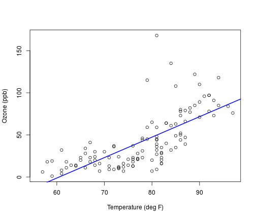
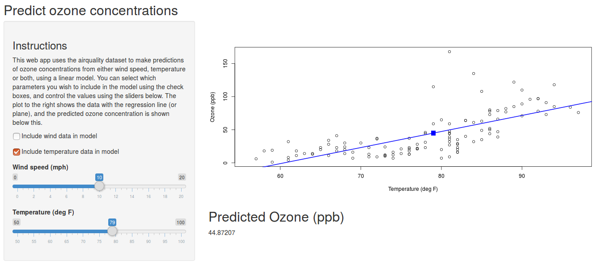

## Air quality

1. The airquality dataset contains daily measurements of ozone, solar radiation, wind speed and temperature from May to September 1973.
2. We wish to predict ozone from either the wind speed or temperature or both.
3. Use a simple linear model.

--- #ExamplePlot

## Example


```r
data("airquality")
plot(airquality$Temp, airquality$Ozone, xlab="Temperature (deg F)", ylab="Ozone (ppb)")
abline(lm(Ozone ~ Temp, data=airquality), col="blue", lwd=2)
```



--- #AppIntro

## Using the app

1. The web app applies simple linear models to the data to predict ozone.
2. You can specify whether to fit to wind, temperature, or both.
3. You can set values for wind and temperature, and get a prediction for ozone concentration.

--- #ShinyApp

## Shiny App

Try for yourself. Find it at https://jamiedw2.shinyapps.io/ShinyProject/


